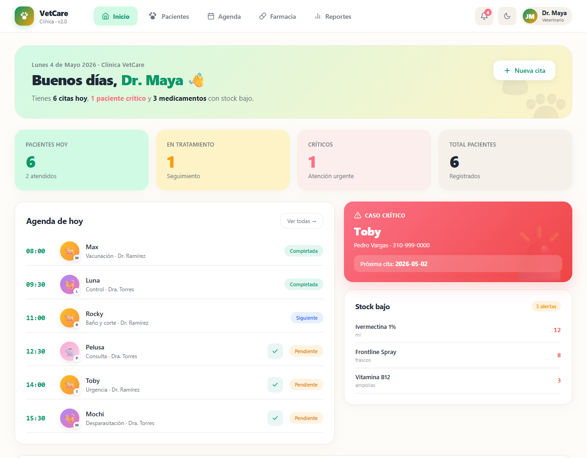
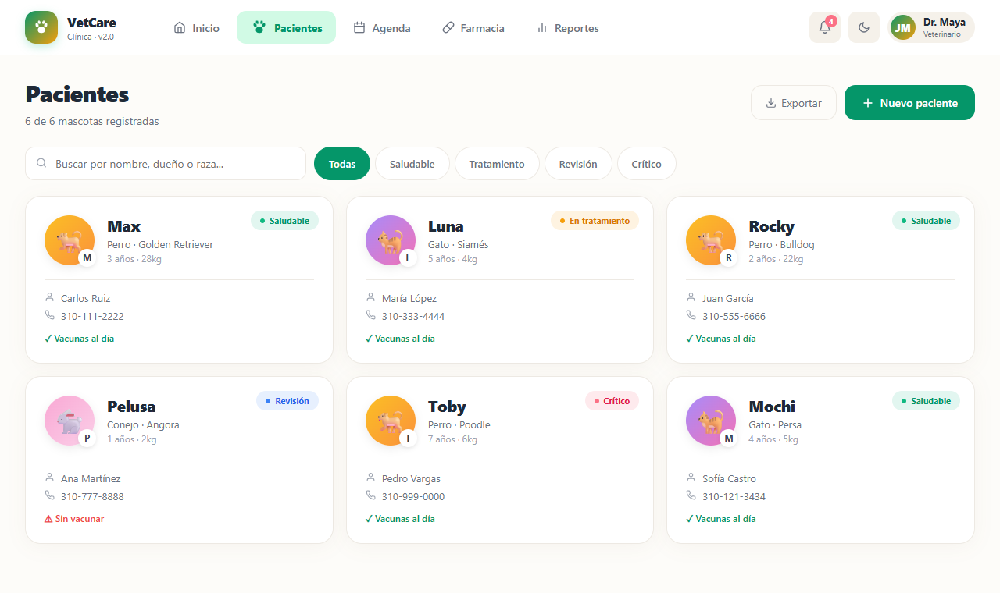
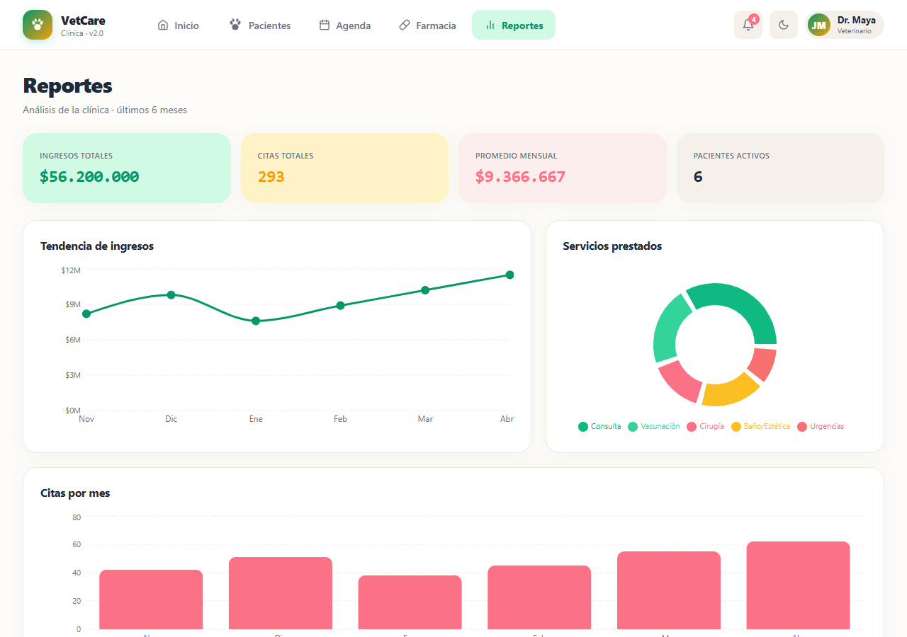

# VetSystem — Veterinary Clinic Management

[](https://github.com/Juanmaya25/vetsystem-clinic/actions/workflows/ci.yml)
[](https://github.com/Juanmaya25/vetsystem-clinic/actions/workflows/deploy.yml)
[](https://opensource.org/licenses/MIT)

> A management dashboard for veterinary clinics — patient records, the day's schedule, a pharmacy inventory with low-stock alerts, and revenue/service analytics, with light/dark themes and a warm "vet-care" visual identity.

**Live demo → [juanmaya25.github.io/vetsystem-clinic](https://juanmaya25.github.io/vetsystem-clinic)**



> Dashboard: the day's snapshot, KPI cards, today's schedule, a critical-case alert and a low-stock panel, plus a 6-month revenue chart.



> Patients: searchable, status-filtered pet records with species avatars and an expandable detail panel (microchip, last/next visit, edit/delete).



> Analytics: revenue trend line, service-mix donut and appointments-per-month bars.

---

## The problem

A small veterinary clinic juggles three things at once that rarely live in the same place: the patient history (which dog, whose owner, which vaccines), the day's appointments, and the medicine cabinet. When a critical case comes in or an antiparasitic runs low, the staff find out too late because nothing surfaces it.

VetSystem puts all of it on one screen. The dashboard answers "what needs my attention right now" — today's appointments, the critical patient, the medicines below their reorder threshold — while patients, schedule, pharmacy and reports each go deep. Everything is in Colombian pesos and the data model mirrors what a real clinic tracks (species, breed, microchip, weight, vaccination status, stock minimums).

## Architecture

Client-side React SPA (no backend; seed data ships in-bundle and lives in component state), organised by responsibility:

```
src/
├── App.jsx                 # Orchestrator: state, business actions, page routing (~230 lines)
├── main.jsx                # React entry point
├── index.css               # Reset, scrollbars, fade-in, responsive grid breakpoints
├── data/
│   ├── seed.js             # Pets, appointments, medicines, revenue & service-mix series
│   └── themes.js           # Light/dark vet-care palettes + status/appt color maps,
│                           #   species gradients & emoji helper
├── utils/
│   ├── format.js           # COP currency formatting
│   ├── csv.js              # CSV serialisation + browser download
│   ├── ids.js              # Sequential ID generation
│   └── styles.js           # Theme-derived inline style factory
├── hooks/
│   └── useToast.js         # Auto-dismissing toast with timer cleanup
├── components/
│   ├── icons.jsx           # Inline SVG icon set (no icon dependency)
│   ├── PetAvatar.jsx       # Species-gradient avatar with initial badge
│   ├── Header.jsx          # Top nav + notifications dropdown + theme toggle
│   ├── Modal.jsx, ConfirmDialog.jsx, Toast.jsx
│   └── PetForm.jsx, ApptForm.jsx, MedForm.jsx
└── pages/
    ├── Dashboard.jsx       # KPIs, today's agenda, critical alert, low stock, revenue
    ├── Patients.jsx        # Searchable/filterable pet cards with expandable detail
    ├── Schedule.jsx        # Day timeline with per-status accent and complete action
    ├── Pharmacy.jsx        # Inventory table with stock bars and low-stock badges
    └── Analytics.jsx       # Revenue line, service donut, appointments bars
```

## Key decisions

| Decision | Why |
|---|---|
| **Refactored a monolithic `App.jsx` (~1,100 lines) into `data / utils / hooks / components / pages`** | The original bundled seed data, the palette, a `PetAvatar`, five page renderers and three modal forms in one file. Splitting by concern makes each clinic area (patients, schedule, pharmacy) independently readable and testable, with the rendered UI kept identical. |
| **Notifications derived, not stored** | Critical-patient and low-stock alerts are computed from the live pet/medicine state with `useMemo`, so the bell badge can never drift out of sync with the underlying data. |
| **`PetAvatar` isolated as a presentational component** | Species → gradient + emoji + initial badge is reused across the dashboard, schedule and patient grid; centralising it keeps those three views visually consistent. |
| **Pharmacy low-stock is a pure threshold (`stock < min`)** | A single derived rule drives the badge, the progress bar color and the dashboard alert — no duplicated logic, and it's covered by tests at the formatting/serialisation boundary. |
| **Pure utilities (`format`, `csv`, `ids`) covered by unit tests** | The logic most likely to regress silently is isolated and tested directly. |

## Tech stack

- **React 18** — hooks, `useMemo`, `useCallback`
- **Vite 5** — dev server + build
- **Recharts** — line, bar and pie charts
- **Vitest + Testing Library + jsdom** — unit and component tests
- **GitHub Actions + GitHub Pages** — CI (test + build) and CD

## Tests

```bash
npm test
```

15 tests across four suites:

- `utils/format.test.js` — COP formatting, null/NaN handling
- `utils/ids.test.js` — sequential ID generation
- `utils/csv.test.js` — header building, quote escaping, row serialisation
- `App.test.jsx` — render smoke test, tab navigation, patient search, pharmacy low-stock, theme toggle

CI runs the full suite and a production build on every push and pull request.

## Run locally

```bash
git clone https://github.com/Juanmaya25/vetsystem-clinic.git
cd vetsystem-clinic
npm install
npm run dev      # http://localhost:5173/vetsystem-clinic/
npm test         # run the test suite
npm run build    # production build to dist/
```

## Author

**Juan José Maya** — Full Stack Developer · San Pedro, Antioquia, Colombia

- Portfolio: [juanmaya25.github.io](https://juanmaya25.github.io)
- GitHub: [@Juanmaya25](https://github.com/Juanmaya25)
- Email: [juanjosemaya2510@gmail.com](mailto:juanjosemaya2510@gmail.com)

## License

MIT © Juan José Maya
